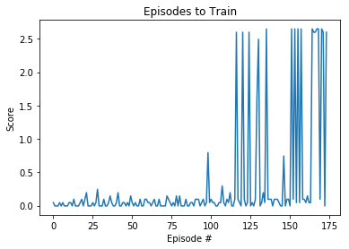
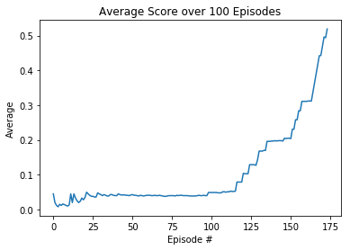

# Report

This project implements a reinforcement learning that controls a simulated pair of tennis playing robots. In this environment, two agents control rackets to bounce a ball over a net. If an agent hits the ball over the net, it receives a reward of +0.1.  If an agent lets a ball hit the ground or hits the ball out of bounds, it receives a reward of -0.01.  Thus, the goal of each agent is to keep the ball in play.

The environment is considered solved, when the average (over 100 episodes) of those **scores** is at least +0.5.

The agents are trained using Proximal Policy Optimization (PPO) Algorithm based on the paper released by [OpenAI](https://blog.openai.com/openai-baselines-ppo/).

## Implementation

The implementation split into a few smaller modules: 

* model.py - Neural Network model implemented with PyTorch
* ppo_agent.py - PPO agent implementation as described in [paper](https://arxiv.org/abs/1707.06347) mentioned above
* train.py - imports all required modules and allows the enviroment to be explored and the agent trained
* play.py - Runs an Agent using pre-trained weights from train.py

## Learning Algorithm

Proximal Policy Optimization was chosen to train the agent because it had been already been implemented in the previous [Continuous Control](https://github.com/rohbot/drl-continuous-control/) project and was shown to perform well with some hyperparameter tunning.

In this implementation the agent model comprises of a pair of neural networks, the actor and the critic networks. The actor network is 3 fully connected layers with ReLu activation on the first two layers. The output of the actor network is normal distribution of the action space. The critic has a similar configuration to the actor but it outputs a single value. The actor controls how the agent behaves and the critic measures how good the action taken is.

1. Collect a batch of N transistions from environment given by BUFFER_SIZE parameter
1. Calculate returns for the using Generalized Advantage Estimation
1. Calculate advantage = returns - values
1. For e epochs given by NUM_EPOCHS parameter
   1. sample enough random mini-batches to cover all data
   1. pass state into network, obtain action, value, entropy and new_log_probs
   1. calculate surrogate policy loss and MSE value loss
   1. backpropogate total loss through network 
1. Repeat steps 1-4 until is agent solves environment
1. If agent fails to solve enviroment, tune hyperparameters and repeat steps 1-5

### Hyperparameters

Initally the hyperparameters were set to the same values as the training code in [Project 2](https://github.com/rohbot/drl-continuous-control/blob/master/train.py) with the TARGET_REWARD adjusted to 0.5 to solved the tennis environment

  GAMMA               = 0.99
  LAMBDA              = 0.95
  BUFFER_SIZE         = 2048
  MINI_BATCH_SIZE     = 64
  PPO_CLIP            = 0.2
  NUM_EPOCHS          = 10
  LEARNING_RATE       = 3e-4
  HIDDEN_SIZE         = 512
  TARGET_REWARD       = 0.5

However after over 1000 episodes with these hyperparameters, the average score over 100 episodes was still well below +0.5.

More research was done into tunning hyperparamter for PPO and using some guideline listed in the Unity ML agent docs, [Training with Proximal Policy Optimization]](https://github.com/Unity-Technologies/ml-agents/blob/master/docs/Training-PPO.md) 

First of all the learning rate was reduced to 1e-4 to allow to smaller gradient updates and the Mini-batch size was increased to 200 and BUFFER_SIZE set to 2000 (10 times the mini-batch size). 

    GAMMA               = 0.97
    LAMBDA              = 0.95
    BUFFER_SIZE         = 2000
    MINI_BATCH_SIZE     = 200
    PPO_CLIP            = 0.2
    NUM_EPOCHS          = 10
    LEARNING_RATE       = 1e-4
    HIDDEN_SIZE         = 512
    TARGET_REWARD       = 0.5

With these parameters the agents can achieve an average score of 0.5 over 100 episodes after 163 episodes

## Results

## Ideas for Future Work
---

* The current implementation is still training the agents as it were one agents, it could be better to implement something similar to [MADDPG](https://arxiv.org/abs/1706.02275) but using PPO instead of DDPG whereby each the actor of each agent is trained on individual local observations and the critic is trained on both observations. 
 
